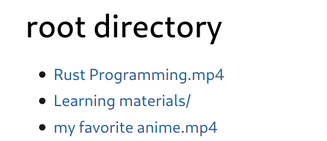

<p align="center">

</p>


A dead simple personal on demand video streaming service written in [Rust](https://www.rust-lang.org/) based on [warp](https://github.com/seanmonstar/warp) and [async/await](https://github.com/rust-lang/rust/issues/50547).

The service serves a directory, and (optionally) transcode the media on the fly. The web UI looks like

<p align="left">

</p>

## Typical use cases 

* Downloading videos on a server with large internet throughput. Then view the video on your laptop (starting from arbitrary position of the video), optionally with lower quality to save bandwidth and get more smooth playing experience.
* Combine with another service like qBittorrent, which downloads submitted links to a specified directory, which can be served by Nozomi Video Streamer.
* ...

## Getting started

Download the binaries from release page. Ensure you have `ffmpeg` installed on your server.

On server 

```
./nozomi-video-streamer --help
./nozomi-video-streamer --serving-dir /data
```

On client now you can play video with (for example)

```
http get 'https://your-domain.com:4000/video-name.mp4' | mpv -
```

or copy the video url (under linux with `xclip` installed) using the client for more customized options:

```
./nozomi-video-streamer-client --help
# this will play the video with 2M bitrate with the url in your clipboard
./nozomi-video-streamer-client --bitrate 2M | mpv - 
```

There are other useful optional arguments like

- `--url`: specify video url manually rather than read from clipboard (if you don't have `xclip` installed you may find this option useful)
- `--start-time`: start playing a video from an offset, the format is `HH:MM:SS`
- `--sub-file`: upload a `.ass` subtitle file and play the video with the uploaded subtitle
